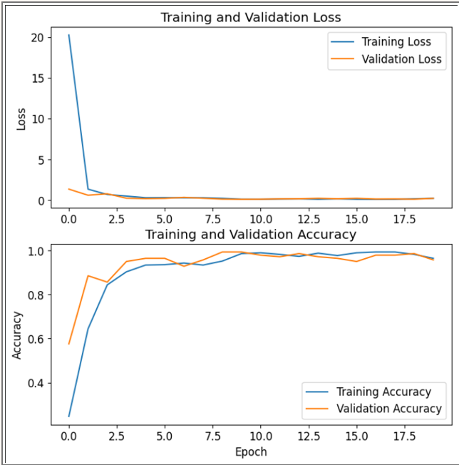
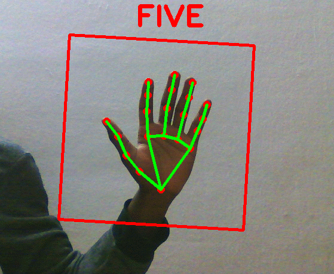

  

# HearMeAI
**Empowering Speech Improvement and Inclusive Communication**

Welcome to HearMeAI, where we're transforming speech therapy and communication through cutting-edge technology.

## 🚀 Key Features

### MetaHuman Integration

  

- Meet Samarth, your lifelike virtual tutor 🧑‍🏫.
- Get personalized guidance for engaging and effective speech therapy 💬.
- Interactive sessions that mimic real-life interactions.

### Phonemes Training

  

- Teaching Lip Movement, Tongue Movement and Teeth Alignment.
- Helpful in improving the pronounciation
  
### Lip Reading Model

  

- Enhance communication accuracy through advanced lip-reading 👄.
- Bridge communication gaps for individuals with unclear speech 🤐.
- Empower inclusivity with clear and precise interactions.

  <h2>Accuracy > 90%</h2>
  

### Hand Sign Detection

  

- Translate sign language into spoken conversation ✋.
- Create connections and inclusivity for the hearing-impaired 🤟.
- Break down communication barriers with ease.

### Phoneme Extraction

  

- Our Python-based tool ensures 100% accuracy in identifying phonemes 🔤.
- Perfect for speech therapy professionals and self-guided therapy.
- Visual representations for articulation improvement.

### User-Friendly Interface

  
  
  
  

- A seamless and intuitive interface for users of all abilities 🌐.
- Accessibility meets functionality for an enjoyable experience 🌟.

## 🚀 Getting Started

1. Clone the repository to your local machine.
2. Install the required dependencies and libraries.
3. Run the application locally or deploy it on your preferred platform.

## 🚀 Contributions Welcome

We welcome contributions to enhance HearMeAI. If you have ideas, bug fixes, or new features to propose, please open an issue or submit a pull request.

## 🚀 Copyright

Copyright Receipt No. : 97101

## 🚀 Contact

For inquiries or support, please contact blackorder.hearme@gmail.com

Join our mission on LinkedIn: [HearMeAI on LinkedIn](https://www.linkedin.com/company/hearmeai/).
